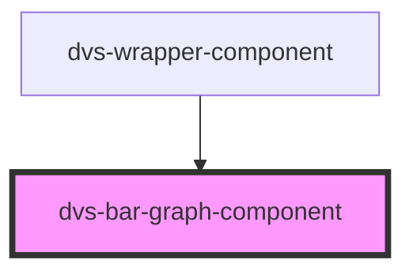

# dvs-bar-graph-component

<!-- Auto Generated Below -->

## Properties

| Property     | Attribute | Description | Type          | Default     |
| ------------ | --------- | ----------- | ------------- | ----------- |
| `height`     | `height`  |             | `number`      | `140`       |
| `widgetData` | --        |             | `IWidgetData` | `undefined` |
| `width`      | `width`   |             | `number`      | `200`       |

## Dependencies

### Used by

 - [dvs-wrapper-component](../..)

### Graph

----------------------------------------------

*Built with [StencilJS](https://stenciljs.com/)*
