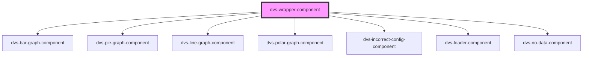

# my-component

<!-- Auto Generated Below -->

## Properties

| Property    | Attribute    | Description                 | Type     | Default     |
| ----------- | ------------ | --------------------------- | -------- | ----------- |
| `height`    | `height`     |                             | `number` | `140`       |
| `widgetKey` | `widget-key` | Key of widget configuration | `string` | `undefined` |
| `width`     | `width`      |                             | `number` | `200`       |

## Dependencies

### Depends on

- [dvs-bar-graph-component](./dvs-widgets/dvs-bar-graph)
- [dvs-pie-graph-component](./dvs-widgets/dvs-pie-graph)
- [dvs-line-graph-component](./dvs-widgets/dvs-line-graph)
- [dvs-polar-graph-component](./dvs-widgets/dvs-polar-graph)
- [dvs-incorrect-config-component](./dvs-widgets/dvs-incorrect-config)
- [dvs-loader-component](./dvs-widgets/dvs-loader)
- [dvs-no-data-component](./dvs-widgets/dvs-no-data)

### Graph

----------------------------------------------

*Built with [StencilJS](https://stenciljs.com/)*
